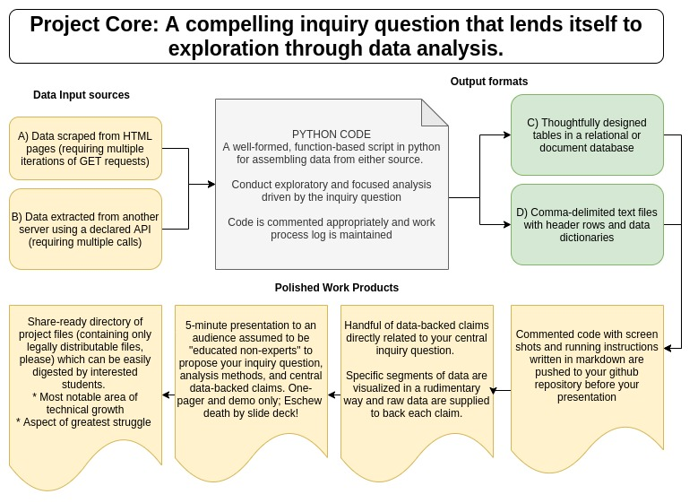

## Project Specification

> Create a culminating project in the Python language that demonstrates solid scripting design and thoughtful program design utilizing methods for modularity and basic data processing with files, APIs, databases, and Pandas.

### Design Requirements

> 1. Thoughtfully use exception handling to cope with unexpected or failure outcomes, such as files not existing, the system not connecting to the Internet for GET requests, etc. When possible write useful information about the source of the errors to a log file for later review and adjustment or re-running of code.
> 2. When possible, consider ways your code can be modularized to be useful for related--but not identical--projects like yours. How can you decouple specific names of pages or HTML elements, for example, from the python code itself? Perhaps custom values can live in text files and be read in dynamically by your python code.
> 3. Create meaningful output messages that your script can give to the user to monitor the progress and activities of your script.

### Project Flowchart

